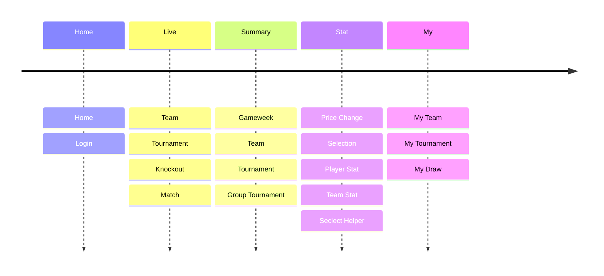
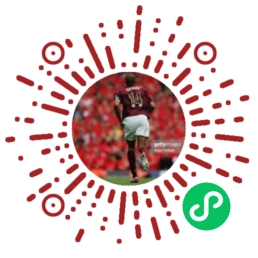

# Overall
The [miniprogram-letletme](https://github.com/tonglam/miniprogram-letletme) was launched in May 2021 and has gained significant traction since the release of the _LetLetMe_ website. 
User feedback indicated that many users accessed the program via mobile devices. 
However, as the website was not initially designed as a responsive web application, the mobile user experience was suboptimal compared to PC browser usage.

To address this, a mobile client was developed. 
Given that a majority of users in China access the program through WeChat, a WeChat mini program was deemed the most suitable solution. 
Consequently, the mini program was displayed in Chinese.

As of 2024, the [miniprogram-letletme](https://github.com/tonglam/miniprogram-letletme) boasts a user base of over 650 and sees active engagement, particularly during Premier League gameweeks.

In terms of technical aspects, during the development of the mini program, I had limited experience with frontend development, leading to some native design and implementation in this project. For instance, state management wasn't implemented using modern practices; instead, it utilized the memory space allowed by WeChat to store the state.

Additionally, the mini program components were structured as class components, impacting the performance due to the less dedicated control of the component lifecycle. The reuse of components wasn't well-organized, resulting in a significant amount of duplicated code. Furthermore, data fetching didn't consider caching, leading to numerous unnecessary requests to the server.

While there is ample room for improvement in the project, I plan to address these issues in the new frontend project. 

As the old saying goes, "Learn good code by bad code."

# Display
some video here.

# Page Navigation

# What is a WeChat (Weixin) Mini Program
A WeChat Mini Program is a lightweight version of an application, often referred to as a mini-app. 
It is seamlessly integrated into the WeChat application, 
allowing users to utilize its features without the need for a separate download and installation. 
Essentially, it functions like a built-in browser within the WeChat messaging and social media platform.

For more information about WeChat Mini Programs, please visit this article: [_What are WeChat Mini-Programs? A Simple Introduction_](https://walkthechat.com/wechat-mini-programs-simple-introduction/).

# How it Works
The [Mini Program Framework](https://developers.weixin.qq.com/miniprogram/en/dev/framework/MINA.html) is crafted to empower developers to create services with a native app experience within WeChat, utilizing the simplest and most efficient methods available. 
The framework system comprises the Logic Layer (App Service) and View Layer (View). 

WeChat Mini Programs introduce their view layer description languages: WXML (WeiXin Markup Language) and WXSS (WeiXin Style Sheets), 
along with a JavaScript-based logic layer framework. 
Additionally, it includes a data transfer and event system facilitating communication between the view layer and logic layer, 
enabling developers to concentrate on data and logic. 
In essence, a `.wxml` file corresponds to an `.html` file, 
a `.wxss` file mirrors a `.css` file, 
and a `.js` file is a JavaScript file.

The framework incorporates _page management_ routers as a means of seamless page switching, 
providing pages with a comprehensive lifecycle. 
It implements full lifecycle management for components, 
automatically triggering lifecycle functions at specific timepoints or in response to framework events.

# Why Get Rid of the Mini Program

## Technical Limitations
As discussed earlier, mini programs are developed under the WeChat Mini Program framework, tightly integrated with the WeChat ecosystem. 
Updates and new features are controlled by the WeChat team, requiring developers to adhere to their rules and guidelines.

However, the mini program framework has limitations compared to web development frameworks. 
It lacks the robustness of web development frameworks like React.js or Vue.js, making it challenging to implement advanced features. 
As the mini program expands, developers may find themselves doing more coding and testing, 
without the support of reliable libraries from the web development world.

Moreover, the codebase of the mini program is not easily reusable in web development or native mobile app development. 
Developers face the dilemma of maintaining multiple codebases for each platform or opting for a cross-platform framework, 
potentially compromising performance and user experience. 
This situation is particularly challenging for a framework catering to users within a single messaging app, such as WeChat.

## Policy Changes
For example, you will need to register a WeChat developer account first and then apply for a mini program. 
Before every release, you will need to submit your mini program for review, sometimes it is done by algorithms, 
sometimes it is done by human reviewers, and wait for 24 hours to get the result. 
It is easy to get rejected for all kinds of nonsense reasons, and you will need to fix them and resubmit again. 
Of course, you will need to wait for another 24 hours.

For example, you will need to register a WeChat developer account first and then apply for a mini program. 
Before every release, you will need to submit your mini program for review, sometimes it is done by algorithms, 
sometimes it is done by human reviewers, and wait for 24 hours to get the result. 
It is easy to get rejected for all kinds of nonsense reasons, and you will need to fix them and resubmit again. 
Of course, you will need to wait for another 24 hours.

When you are using a personal account, it has more restrictions, for example, 
you cannot integrate anything with payment, you cannot have a content board for users to leave a message or something, etc.

What is worse is in 2024, if your mini program is not verified by WeChat, it will be banned from the search result or sharing pages to other users, 
and it will be hard for users to find your mini program, 
and for sure there will be fewer and fewer users left unless paying for the verification every single year and yet again let them review your mini program.

And this makes me sick, as a developer, I want to focus on the development, not the policy and the review process. 
And I am sure no developer wants to be controlled by a single company that much.

 

For these reasons, the mini program will not be maintained anymore after the 2023-2024 Premier League season. 
All the services will be moved to the website, which is more flexible and more powerful in the project [letletme-web](https://github.com/tonglam/letletme-web).

# How to Use
For now, the only way to access the mini program is by scanning the provided QR code with your WeChat app.

